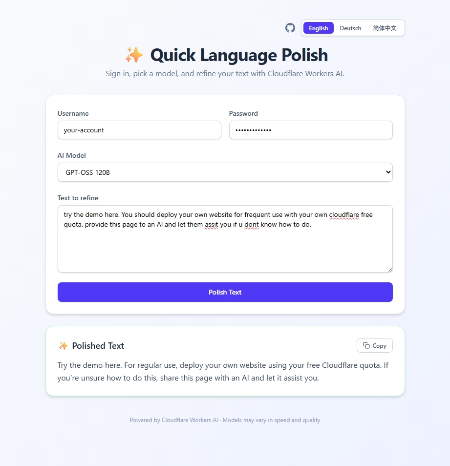

# Quick Language Polish ✨

[English](README.md) · [Deutsch](README.de.md) · [简体中文](README.zh-CN.md)

Eine Cloudflare-Workers-App auf Basis von Bun, TypeScript, Vite und Vue, die Texte mit Workers AI verfeinert. Probieren Sie die [Live-Demo](https://quick-language-polish.karsten-zhou-773.workers.dev/).

Für den produktiven Einsatz stellen Sie Ihre eigene Instanz mit Ihrem eigenen kostenlosen Cloudflare-Kontingent bereit. Mit dem Button oben können Sie per Klick deployen, oder folgen Sie der manuellen Einrichtung unten.

[](https://deploy.workers.cloudflare.com/?url=https://github.com/XiaoSong-CPE/quick-language-polish)



## Funktionen

- KI-gestützte Textverfeinerung
- Mehrere Cloudflare AI-Modelle zur Auswahl
- Streaming-Antworten (SSE)
- Einfacher HTTP-Basic-Auth-Schutz
- Ein-Klick-Bereitstellung auf Cloudflare Workers

## Voraussetzungen

- [Bun](https://bun.sh) (empfohlen) oder Node.js 22+
- Ein Cloudflare-Konto mit aktiviertem [Workers AI](https://developers.cloudflare.com/workers-ai/)

## Einrichtung

### 1. Abhängigkeiten installieren

```bash
bun install
# oder: npm install
```

### 2. Anmeldedaten konfigurieren (optional, aber empfohlen)

Die App funktioniert auch ohne Authentifizierung – jeder mit der URL kann Ihre Instanz nutzen. Wenn Sie sie schützen möchten, konfigurieren Sie Anmeldedaten.

Kopieren Sie die Beispiel-Umgebungsdatei und bearbeiten Sie sie:

```bash
cp .env.example .env
```

Legen Sie `AUTH_USERNAME` und `AUTH_PASSWORD` in `.env` mit Ihren eigenen Anmeldedaten fest.

Für die Produktion laden Sie dieselben Secrets in Cloudflare hoch:

```bash
bunx wrangler secret put AUTH_USERNAME
bunx wrangler secret put AUTH_PASSWORD
```

> **Hinweis:** Speichern Sie Anmeldedaten nicht als normale `vars` in `wrangler.jsonc`. Verwenden Sie stattdessen Secrets – diese werden verschlüsselt gespeichert und sind im Cloudflare-Dashboard nicht einsehbar.
>
> **⚠️ Wenn Sie diesen Schritt überspringen**, ist Ihre Instanz öffentlich zugänglich. Jeder mit der URL kann sie nutzen und Ihr kostenloses Workers AI-Kontingent verbrauchen. Dies ist praktisch für den persönlichen Gebrauch, wird jedoch für gemeinsam genutzte oder produktive Umgebungen nicht empfohlen.

### 3. Lokal ausführen

```bash
bun run dev
```

### 4. Bauen

```bash
bun run build
```

### 5. Bereitstellen

```bash
bun run deploy
```

## API

### `POST /api/polish`

Unterstützt optionale **HTTP Basic Auth**. Wenn `AUTH_USERNAME`- und `AUTH_PASSWORD`-Secrets konfiguriert sind, authentifiziert sich der Client mit dem in der Benutzeroberfläche eingegebenen Benutzernamen und Passwort. Ohne Konfiguration wird die Authentifizierung übersprungen und der Endpunkt ist offen.

**Request-Body:**

```json
{
  "text": "Ihr zu verfeinernder Text",
  "model": "@cf/qwen/qwen3-30b-a3b-fp8"
}
```

Das Feld `model` ist optional und verwendet standardmäßig `@cf/meta/llama-4-scout-17b-16e-instruct`.

**Antwort:** Gibt eine SSE-Antwort (`text/event-stream`) im OpenAI-kompatiblen Streaming-Format zurück, mit `data: {"choices":[{"delta":{"content":"token"}}]}`-Chunks gefolgt von `data: [DONE]`.

### Verfügbare Modelle

| Modell-ID                                 | Bezeichnung                                        |
| ----------------------------------------- | -------------------------------------------------- |
| `@cf/meta/llama-4-scout-17b-16e-instruct` | Llama 4 Scout 17B _(Standard)_                     |
| `@cf/qwen/qwen3-30b-a3b-fp8`              | Qwen 3 30B                                         |
| `@cf/google/gemma-4-26b-a4b-it`           | Gemma 4 26B                                        |
| `@cf/openai/gpt-oss-120b`                 | GPT-OSS 120B                                       |
| `@cf/moonshotai/kimi-k2.6`                | Kimi K2.6 _(kostenpflichtiger Tarif erforderlich)_ |

### Fehlerantworten

| Status | Bedeutung                                                       |
| ------ | --------------------------------------------------------------- |
| `400`  | Ungültige Anfrage (fehlende oder fehlerhafte Eingabe)           |
| `401`  | Falsche Anmeldedaten — überprüfen Sie Benutzername und Passwort |
| `422`  | Modell hat die Anfrage abgelehnt                                |
| `500`  | Server-Fehlkonfiguration (fehlende Bindings oder Secrets)       |
| `502`  | Workers AI-Laufzeitfehler                                       |
